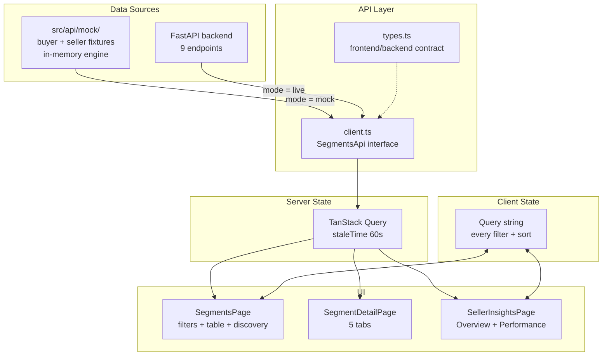
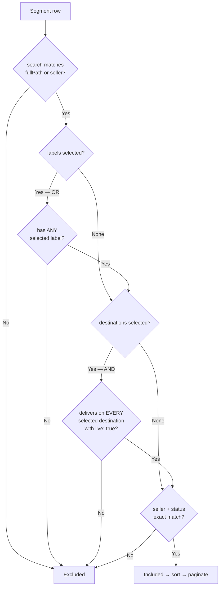
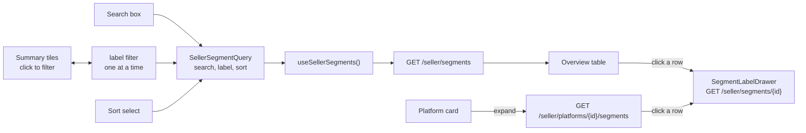
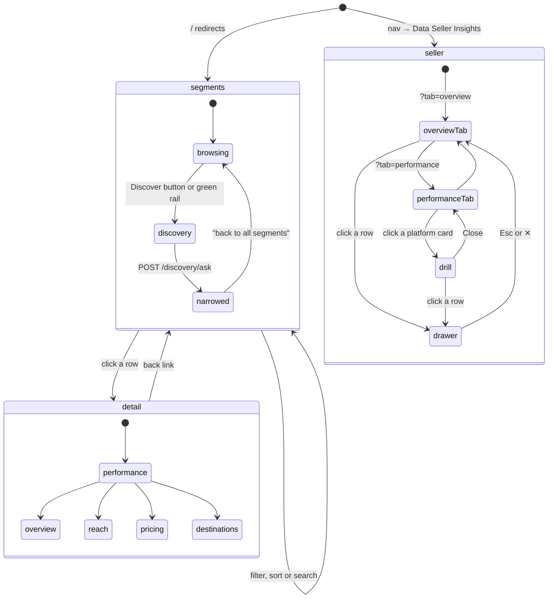
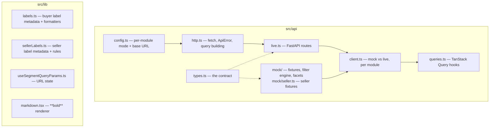

# lr-bestsellers-ui

LiveRamp's Data Marketplace has close to a million syndicated segments. They are easy to *browse* and hard to *judge*. Two segments with the same name and similar cookie reach can behave completely differently once activated, and nothing in a normal catalogue table tells you which one advertisers actually keep buying.

**lr-bestsellers-ui** is the Connect UI for **Marketplace Performance Labels**, and it has two halves built on the same delivered-usage data:

- **Data Marketplace Segments** (buy side, `/segments`) — a segment browser where every row carries evidence of delivered marketplace usage: who reuses it, where it actually delivers, whether usage is climbing. Plus an AI Discovery panel you can ask in English instead of filtering by hand.
- **Data Seller Insights** (sell side, `/seller-insights`) — the same signals turned around for the seller who owns the listings: which of *your* segments earn demand labels, which are quietly leaking revenue, and how each destination is performing.

You do **not** need a backend to run it. It ships with bundled fixtures, boots standalone with `npm run dev`, and switches to FastAPI one module at a time by changing environment variables.

---

## Why this is not "just a table with badges"

A catalogue table answers *what exists*. A buyer is asking *what works*. Those need different data and different filter semantics.

Performance labels are **OR-ed** — ticking *Top performer* and *Trending up* widens the result set, because the facet counts are independent and a buyer ticking two labels means "either is fine". Destinations are **AND-ed** — "proven on Facebook *and* Snapchat" is the actual activation question, and a destination only counts when it is genuinely delivering (`live: true`), not merely distributed.

That asymmetry is the product, not an implementation detail. The backend must mirror it exactly or the counts stop agreeing with the rows.

---

## High-level architecture



`src/api/client.ts` is the single switch point, and it resolves **one module at a time** — so a slice the backend has not shipped yet stays on fixtures while everything else talks to FastAPI. Everything above the client is unaware of which implementation is running:

```ts
function pick<K extends keyof SegmentsApi>(key: K, module: ApiModule): SegmentsApi[K] {
  return apiModeFor(module) === 'live' ? liveApi[key] : mockApi[key]
}

export const api: SegmentsApi = {
  listSegments: pick('listSegments', 'segments'),
  askDiscovery: pick('askDiscovery', 'discovery'),
  listSellerSegments: pick('listSellerSegments', 'seller'),
  // …one entry per endpoint
}
```

The three modules are `segments` (catalogue, facets, detail), `discovery` (the AI panel) and `seller` (Data Seller Insights). See [Environment reference](#environment-reference).

---

## Request pipeline

```mermaid
flowchart LR
    Bar["FilterBar\nsearch debounced 300ms"] --> Hook["useSegmentQueryParams\nq, label, dest, seller, status, sort, dir"]
    Hook --> URLState["Browser query string\nshareable + back button"]
    URLState --> Q["SegmentQuery object"]
    Q --> Hooks["useSegments()\nqueryKey ['segments', q]"]
    Hooks --> API["api.listSegments()"]
    API --> HTTP["http.ts buildQueryString\nrepeated keys for lists"]
    HTTP --> Resp["Paginated[Segment]"]
    Resp --> Table["SegmentsTable\nmanualSorting: true"]
```



URL params are deliberately shorter than API params — `q` → `search`, `label` → `labels`, `dest` → `destinations`, `dir` → `direction`. Changing any filter drops `page`, so pagination resets.

---

## Filter semantics



Reference implementation is `src/api/mock/index.ts`. Search also does a whitespace-stripped pass, so `"smart watch"` matches `"Smartwatch"`.

---

## Data Seller Insights

The seller-side module at `/seller-insights`. Same delivered-usage data, opposite audience: instead of "which segment should I buy", it answers "which of my listings are earning, and which are quietly broken".

**Two tabs.** *Overview* is the label snapshot — six count tiles, a searchable/sortable table of your segments, and the labels each has earned. *Performance* is the destination view — channel cards, a card per platform, and a drill-down into that platform's segments.

**Ten labels, two audiences.** The six *demand* labels are the ones buyers see on your listings. The four *attention* labels are private to the seller and never leave this page:

| Label | Kind | Earned when |
|---|---|---|
| Best seller | demand | Top 10% of your catalogue **and** its category cohort by 90-day revenue, ≥ 5 buyers |
| Top campaign spend | demand | Top 10% by media spend running against the segment |
| Most impressions | demand | Top 10% by delivered impressions in its cohort |
| Multi-platform | demand | Delivered impressions on ≥ 3 destinations in the window |
| Rising | demand | Revenue up ≥ 40% vs the prior 90 days, above the volume floor |
| Repeat buyers | demand | ≥ 60% of buyers active in one month were active again the next |
| Dormant | attention | No revenue on any destination for 12 months |
| Distributed, not delivering | attention | Live distribution, no impressions for 60 days |
| Requested, not distributed | attention | Buyers requested it but never set up distribution |
| Single-buyer concentration | attention | One buyer is > 80% of revenue |

Definitions live in `src/lib/sellerLabels.ts` — text, icon, kind, badge class and the criteria sentence shown in the drawer. The backend sends label **keys**; all display copy is frontend-owned.

**Filter semantics differ from the buy side.** There is one active label filter at a time, not a multi-select, and the tiles and the dropdown are the same piece of state — clicking a tile moves the dropdown and vice versa. Two pseudo-filters exist alongside the ten real labels: `needs_attention` (any attention label) and `no_labels` (none earned). In the platform drill-down the chips **are** multi-select and OR-ed, because there you are triaging a list rather than answering one question.

**Labels are destination-specific.** A segment can be a best seller on Facebook and dormant on Mountain, which is why the drill-down repeats the label column rather than reusing the Overview values.



Filtering and sorting happen in the **API layer**, mock and live alike, so the live backend owns them rather than the component re-implementing them.

---

## Navigation and view state



The detail page opens on **Marketplace performance**, not Overview — the performance evidence is the reason the page exists.

On the seller side only the **tab** lives in the URL (`?tab=performance`); search, label filter, sort and the open platform are local component state. The label drawer is a Radix Dialog, so Escape and focus trapping come for free.

---

## Module layout



Full component list:

```
components/
  AppLayout.tsx      Shell + mock-mode banner
  SideNav.tsx        Black LiveRamp nav, collapsible groups
  FilterBar.tsx      Search, Status, Sellers, More Filters, Discover
  FacetDropdown.tsx  Reusable multi-section facet popover
  FilterChips.tsx    Removable active-filter chips + sort control
  SegmentsTable.tsx  TanStack Table; full and compact variants
  DiscoveryPanel.tsx AI Segment Discovery conversation panel
  PerformanceTab.tsx Marketplace performance detail tab
  UsageSparkline.tsx ScoreBar.tsx DestinationDots.tsx Badge.tsx Checkbox.tsx

  seller/
    SellerBadge.tsx          Label badge, status pill, platform mark, path
    LabelSummaryTiles.tsx    Six clickable count tiles that drive the filter
    SellerSegmentsTable.tsx  Overview table
    ChannelCards.tsx         Programmatic / Social / TV summary cards
    PlatformGrid.tsx         Per-destination cards, expandable
    PlatformDrill.tsx        Destination-specific rows + label chips
    SegmentLabelDrawer.tsx   Right-hand label explainer (Radix Dialog)
```

---

## Quick start

1. Requires Node **18+** (20 LTS recommended). Check with `node -v`; `nvm install 20` if older.
2. Install: `npm install`
3. Configure: `cp .env.example .env` — defaults run on mock data, nothing else to set.
4. Run: `npm run dev`
5. Open <http://localhost:5173>. A yellow banner names whichever modules are on mock data.

No Python, FastAPI or database is needed for steps 1–5.

### Troubleshooting: live mode loads but every field is empty

Almost always a **casing mismatch**. The UI expects camelCase JSON (`marketplaceScore`); Pydantic emits snake_case by default. Add an alias generator to your models:

```python
from pydantic import BaseModel, ConfigDict
from pydantic.alias_generators import to_camel

class CamelModel(BaseModel):
    model_config = ConfigDict(alias_generator=to_camel, populate_by_name=True)
```

Other common ones:

```bash
# Changed .env but nothing happened — Vite reads env only at startup
# (and ignores any variable not prefixed VITE_)
npm run dev

# Blank page with a module resolution error
rm -rf node_modules package-lock.json && npm install

# Live mode returns 404s — check what FastAPI is actually serving
open http://localhost:8000/docs

# Anything odd — types catch it faster than the browser will
npm run typecheck
```

Styles missing? Tailwind only scans `./index.html` and `./src/**/*.{ts,tsx}` — a component outside `src/` gets no styles.

---

## Environment reference

| Variable | Read by | Meaning |
|---|---|---|
| `VITE_API_MODE` | `config.ts` | Default mode for every module: `mock` (default) or `live` |
| `VITE_API_MODE_SEGMENTS` | `config.ts` | Override for the catalogue, facets and segment detail |
| `VITE_API_MODE_DISCOVERY` | `config.ts` | Override for `POST /discovery/ask` |
| `VITE_API_MODE_SELLER` | `config.ts` | Override for Data Seller Insights |
| `VITE_API_BASE_URL` | `config.ts` → `API_BASE_URL` | Prefix for every request; default `/api` |
| `VITE_FASTAPI_ORIGIN` | `vite.config.ts` | Dev-proxy target; default `http://localhost:8000` |
| `VITE_MOCK_LATENCY_MS` | `config.ts` → `MOCK_LATENCY_MS` | Simulated network delay, default `250` |

An unset or unrecognised override falls back to `VITE_API_MODE`. `API_MODE` is still exported for callers that want one answer, and now means "live only when **every** module is live".

Vite reads `.env` once at **startup** — restart the dev server after any change. Variables without a `VITE_` prefix are ignored.

---

## Switching to the FastAPI backend

```bash
# .env — everything live
VITE_API_MODE=live
VITE_API_BASE_URL=/api
VITE_FASTAPI_ORIGIN=http://localhost:8000
```

You rarely get all nine endpoints at once, so modules switch independently:

```bash
# Catalogue is live; discovery and seller insights aren't built yet
VITE_API_MODE=mock
VITE_API_MODE_SEGMENTS=live

# The opposite — demo the seller module against the real backend,
# keep the buy side on fixtures
VITE_API_MODE=mock
VITE_API_MODE_SELLER=live
```

The banner across the top of the app lists exactly which modules are still on fixtures, so a half-live session is never ambiguous.

`vite.config.ts` proxies `/api` to `VITE_FASTAPI_ORIGIN`, so **CORS does not need configuring** in development. To call FastAPI directly instead, set `VITE_API_BASE_URL=http://localhost:8000` and add `CORSMiddleware`.

| Method | Path | Returns | Module |
|---|---|---|---|
| `GET` | `/segments` | `Paginated[Segment]` | `segments` |
| `GET` | `/segments/facets` | `SegmentFacets` | `segments` |
| `GET` | `/segments/{id}` | `SegmentDetail` | `segments` |
| `POST` | `/discovery/ask` | `AiDiscoveryResponse` | `discovery` |
| `GET` | `/seller/segments` | `Paginated[SellerSegment]` | `seller` |
| `GET` | `/seller/segments/{id}` | `SellerSegmentDetail` | `seller` |
| `GET` | `/seller/summary` | `SellerInsightsSummary` | `seller` |
| `GET` | `/seller/platforms` | `list[PlatformPerformance]` | `seller` |
| `GET` | `/seller/platforms/{id}/segments` | `list[PlatformSegmentRow]` | `seller` |

`/seller/segments` takes `search`, `label` and `sort` (`revenue_rank` \| `revenue` \| `buyers_with_revenue`). `label` accepts any of the ten label keys plus `needs_attention` and `no_labels`.

**[BACKEND_API.md](./BACKEND_API.md) is the full specification** for the four buy-side endpoints — every query parameter, field-level response tables, error and auth behaviour, and paste-ready Pydantic models. **The five `/seller/*` endpoints are not in it yet**; until they are, `src/api/types.ts` (the `Data Seller Insights` section) and `src/api/live.ts` are the contract. `live.ts` is the only file that knows route paths; edit it there if yours differ.

Keep types in sync automatically once the backend is up:

```bash
npx openapi-typescript http://localhost:8000/openapi.json -o src/api/schema.d.ts
```

---

## Interaction examples

| What you do | What happens | Where |
|---|---|---|
| Type `smart watch` | Debounced 300 ms, matches path and seller, whitespace-insensitive | `FilterBar.tsx` |
| Tick *Top performer* + *Trending up* | Results **widen** (OR) | `mock/index.ts` |
| Tick *Facebook* + *Snapchat* | Results **narrow** to segments live on both (AND) | `mock/index.ts` |
| Click a column header | Server-side re-sort; clicking the active column flips direction | `SegmentsTable.tsx` |
| Copy the URL after filtering | Filters and sort travel with the link; back button works | `useSegmentQueryParams.ts` |
| Ask the Discovery panel a question | Left table narrows to the AI's candidate set | `DiscoveryPanel.tsx` |
| Click any row | Detail page, opening on Marketplace performance | `SegmentDetailPage.tsx` |
| Open **Data Seller Insights** | Seller module; `?tab=` makes the tab shareable | `SellerInsightsPage.tsx` |
| Click a **Need attention** tile | Filters to segments carrying any private attention label | `LabelSummaryTiles.tsx` |
| Click **Download CSV** | Exports the **currently filtered** rows, labels included | `SellerInsightsPage.tsx` |
| Expand a platform card | Loads that destination's segments and their per-destination labels | `PlatformDrill.tsx` |
| Click a seller row | Drawer: KPIs, buyer funnel, why each label was earned, suggested action | `SegmentLabelDrawer.tsx` |

Consuming the API from a component:

```tsx
import { useSegments, useFacets } from '@/api/queries'

const { data: facets } = useFacets()                         // cached 5 min
const { data } = useSegments({ labels: ['top_performer'], sort: 'cpc' })

data?.items.map((s) => s.name)
```

Calling it directly, outside React:

```ts
import { api } from '@/api/client'

const page = await api.listSegments({ search: 'wearables', page: 1, pageSize: 25 })
const detail = await api.getSegment('4481902')
```

Seller-side hooks follow the same shape:

```tsx
import { useSellerSegments, useSellerSummary, usePlatforms } from '@/api/queries'

const { data: summary } = useSellerSummary()                    // tiles + channels
const { data } = useSellerSegments({ label: 'needs_attention', sort: 'revenue' })
const { data: platforms } = usePlatforms()
```

---

## Development commands

```bash
npm install
npm run dev          # hot reload on :5173
npm run typecheck    # tsc --noEmit; silence means success
npm run build        # typecheck, then build to dist/
npm run preview      # serve the built dist/ locally
```

---

## Backend contract (short)

- **camelCase** response bodies; `page_size` is the only snake_case query param
- **Repeated query keys** for list filters (`?labels=a&labels=b`), never CSV
- **Labels OR-ed, destinations AND-ed**, and destinations only count when `live: true`
- **Facet counts are catalogue-wide**, not scoped to the current result set
- **Dates are bare `YYYY-MM-DD`** — timestamps break date formatting
- `**bold**` is the **only markup** the UI parses in backend-authored prose
- Declare `/segments/facets` **before** `/segments/{id}` or `facets` is read as an id

---

## Known gaps

- Pagination is computed but no pager control is rendered (fixtures fit one page)
- Reach and Pricing tabs show the fields we have; **Est. CPM is `cpc * 8.4`**, a hardcoded frontend multiplier with no backend origin
- Discovery responses are canned in mock mode; if the backend streams, swap `apiFetch` for a `StreamingResponse` reader in `live.ts`
- No auth anywhere — `src/api/http.ts` is the single place to add a token or tenant header
- Row selection is client-only; nothing is posted. "Download Full Catalog" is inert
- Seller module: every platform drills into the **same** fixture rows in mock mode; the live backend is expected to return destination-specific ones
- Seller module: the Categories and Destinations pickers on the Performance tab are static display chips, not wired to a facet source
- Seller module: `/seller/segments` returns one unpaginated page — fine for a seller's own catalogue at fixture scale, revisit past a few hundred rows
- Seller fixtures carry a single tenant (`123Push`) and no auth scoping; the live backend must derive the seller from the session
- No tests yet

---

## Docs and status

| Document | Covers |
|---|---|
| **README.md** (this file) | Architecture, setup, contract summary |
| **[BACKEND_API.md](./BACKEND_API.md)** | Full API spec for the backend team |
| **[READ.md](./READ.md)** | Long-form install walkthrough and troubleshooting |
| **[PLAN.md](./PLAN.md)** | What was built, why, and what's left |

Internal LiveRamp tooling. Node **18+**, Vite **8**, React **18**, TypeScript **5.7**.
